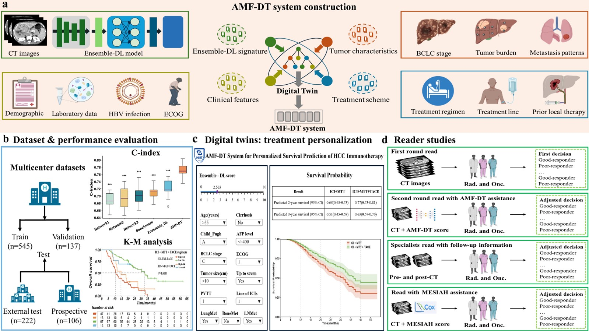

# AMF-DT

## Overview
<div style="text-align:justify">

</div>



## 1. Software Requirements
All experiments in this study were conducted on a computing platform equipped with an NVIDIA RTX 3090 GPU, with each deep learning network implemented using the PyTorch framework. Statistical analyses and model interpretability assessments were carried out in a standardized statistical computing environment, primarily using Python 3.7.3 and R 4.3.0. Key Python dependencies included scikit-learn (v1.0.2), scikit-survival (v0.17.2), lifelines (v0.27.4), and shap (v0.41.0), among others. This setup provided strong support for efficient experimentation and reliable reproducibility of results.

## 2. Environmental settings

Please follow the guide to install and set up the project.

Clone the repository
```
git clone https://github.com/Zayn-Wang/AMF-DT.git
```
Set up a clean python3 virtual environment, i.e.
```
python3 -m venv medvenv
source medvenv/bin/activate
```
Install necessary dependencies:
```
pip install -r requirements.txt
```

## 3. Download Datasets

Data related to this study, including de-identified participant data with the accompanying data dictionary, original CT images, study protocol, and statistical analysis plan, will be made available to the scientific community upon publication. Requests for these data should be directed to the corresponding authors and must be reasonable. A signed data use agreement and institutional review board approval will be required before the release of any research data. We have provided sample data, which you can access via Google Drive:
https://drive.google.com/drive/folders/16H2SUdmXoRx9Z6LtVscQOK7U7RlcdzUI?usp=drive_link

## 4. Training & Evaluate
Using the scripts on scripts directory to train and evaluate the model.
### Training

You can run the following three scripts sequentially to train the three models separately. During training, each model is evaluated and the best-performing weights for OS and PFS are automatically saved for subsequent testing and analysis. 
```
python -m torch.distributed.run --nproc_per_node=6 -m main.train_subnet1 \
  --gpu 0,1,2,3,4,5 \
  --lr 0.0001 \
  --lr_decay 0.15 \
  --rand_p 0.45 \
  --max_epochs 250 \
  --train_batch 4 \
  --val_batch 8 \
  --test_batch 8 \
  --skip_epoch_model 25 \
  --best_model_name multitask_subnet1 \
  --train_dir "../samples/Input_Train/" \
  --val_dir "../samples/Input_Val/" \
  --test_dir "../samples/Input_Test/" \
  --train_csv "../samples/train_events.csv" \
  --val_csv "../samples/valid_events.csv" \
  --test_csv "../samples/test_events.csv" \
```
```
python -m torch.distributed.run --nproc_per_node=5 -m main.train_subnet3 \
  --gpu 1,2,3,4,5 \
  --lr 0.00001 \
  --lr_decay 0.1 \
  --rand_p 0.35 \
  --max_epochs 250 \
  --train_batch 16 \
  --val_batch 16 \
  --test_batch 16 \
  --skip_epoch_model 40 \
  --best_model_name multitask_subnet3 \
  --train_dir "../samples/Input_Train/" \
  --val_dir "../samples/Input_Val/" \
  --test_dir "../samples/Input_Test/" \
  --train_csv "../samples/train_events.csv" \
  --val_csv "../samples/valid_events.csv" \
  --test_csv "../samples/test_events.csv" \
```
```
python -m torch.distributed.run --nproc_per_node=5 -m main.train_subnet5 \
  --gpu 1,2,3,4,5 \
  --lr 0.00001 \
  --lr_decay 0.01 \
  --drop_rate 0.1 \
  --rand_p 0.3 \
  --max_epochs 250 \
  --train_batch 4 \
  --val_batch 4 \
  --test_batch 4 \
  --skip_epoch_model 40 \
  --best_model_name multitask_subnet5 \
  --train_dir "../samples/Input_Train/" \
  --val_dir "../samples/Input_Val/" \
  --test_dir "../samples/Input_Test/" \
  --train_csv "../samples/train_events.csv" \
  --val_csv "../samples/valid_events.csv" \
  --test_csv "../samples/test_events.csv" \
```
### Evaluate
During the model evaluation stage, you can find the evaluation ```.sh``` scripts in the scripts directory. An example command for running the evaluation is provided below.
```
python -m inference.run_subnet1 \
  --gpu 1 \
  --val_batch 16 \
  --num_workers_val 10 \
  --best_model_name multitask_subnet1 \
  --test_dir "../samples/Input_Test/" \
  --pfs_model_path "../weights/multitask_subnet1_PFS.pth" \
  --os_model_path "../weights/multitask_subnet1_OS.pth"
```

## 5. RSF-Based Ensemble Signature
To obtain a robust imaging signature, risk vectors from the three deep learning models were fused using a Random Survival Forest (RSF) instead of simple averaging. Trained with survival data, the RSF generated out-of-bag predictions that served as the final Ensemble-DL signature.

```
python RandomSurvivalForest.py
```

## 6. Digital Twin System
The MMF-DT system has been integrated into an interactive online application, freely accessible at [https://tfwang.shinyapps.io/InteractiveMedicalPrediction/](https://tfwang.shinyapps.io/InteractiveMedicalPrediction/).

```
app_digital_twins.R
```
# License
This project is licensed under the GPLv3 License and is available for non-commercial academic purposes.
