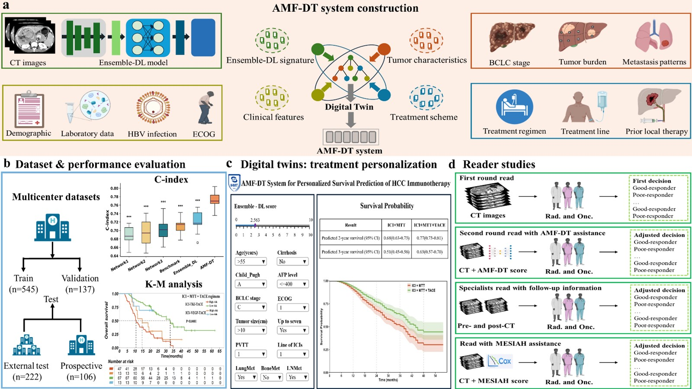

# AMF-DT

***Counterfactual Digital Twin for Personalized Treatment Optimization in Hepatocellular Carcinoma Immunotherapy***.

AMF-DT (AI-powered Multimodal Fusion Digital Twin) combines three complementary deep-learning imaging subnetworks with clinical, tumor and treatment variables. The resulting ensemble signature is used by a random survival forest and an interactive digital-twin application to support treatment-conditional survival estimation.

The source code is openly available at [http://github.com/Zayn-Wang/AMF-DT](https://github.com/Zayn-Wang/AMF-DT).



## Repository contents

```text
main/                    Training entry points for the three imaging subnetworks
inference/               Independent inference and cohort evaluation entry points
models/                  Neural-network definitions
samples/                 De-identified example tabular files
scripts/                 Shell wrappers for the training and evaluation commands
RandomSurvivalForest.py  Ensemble-signature construction
app_digital_twins.R      Local Shiny application source
requirements.txt         Python environment specification
LICENSE                  GNU General Public License v3
```

The repository does not contain the complete patient-level dataset, raw CT archive or trained model weights. The image directories and weight files referenced below must be obtained through the approved data-access route or generated locally.

## Software and hardware

The reported analyses used Python 3.7.3, R 4.3.0 and PyTorch 1.13.0. The Shiny application source records R 4.2.0 as its development environment. Important pinned Python packages include scikit-learn 1.0.2, scikit-survival 0.17.2, lifelines 0.27.4, SHAP 0.41.0 and SimpleITK 2.2.0. CT preprocessing used nnU-Net v1.7.0 for liver segmentation and Elastix v5.0.1 for registration. Acquisition and software platforms varied across participating centres. No proprietary software was used.

The original deep-learning experiments used NVIDIA RTX 3090 GPU hardware. The training entry points support a single GPU and PyTorch distributed execution; the full study pipeline requires a CUDA-capable GPU and sufficient memory for 3D CT volumes.

The source imports `monai`, `tensorboardX` and `einops`, but these packages are not currently pinned in `requirements.txt`. Install versions compatible with Python 3.7.3 and PyTorch 1.13.0 in the validated environment before running the training or inference entry points.

## Installation

Clone the repository and create an isolated Python environment:

```bash
git clone https://github.com/Zayn-Wang/AMF-DT.git
cd AMF-DT

python3.7 -m venv medvenv
source medvenv/bin/activate
# Windows PowerShell: .\medvenv\Scripts\Activate.ps1

python -m pip install -r requirements.txt
```

The pinned requirements file records the broader analysis environment. Some packages in that file are platform-specific; Python 3.7.3 and the corresponding PyTorch/CUDA stack should be used when reproducing the reported results.

## Data availability and layout

Representative de-identified CT imaging data have been deposited in the [Science Data Bank](https://www.scidb.cn/en). During peer review, editors and reviewers will be provided with a private link to access the complete database. Other qualified researchers may request access from the corresponding author for non-commercial research purposes.

The complete patient-level clinical data and raw CT imaging dataset are available from the corresponding author upon reasonable request. Access is subject to approval by the requesting institution's institutional review board and execution of a formal data use agreement, and the data may be used only for non-commercial academic research owing to patient privacy requirements and restrictions imposed by the ethics approvals of the participating centres.

A small de-identified example set is also available through [Google Drive](https://drive.google.com/drive/folders/16H2SUdmXoRx9Z6LtVscQOK7U7RlcdzUI?usp=drive_link).

The tabular example files included in this repository are:

```text
samples/
|-- train_events.csv
|-- valid_events.csv
|-- test_events.csv
`-- data/
    |-- train_cohort.csv
    |-- valid_cohort.csv
    `-- test_cohort.csv
```

The deep-learning data loader expects authorized CT files and event tables in the following layout:

```text
samples/
|-- Input_Train/Patient_*.nii.gz
|-- Input_Val/Patient_*.nii.gz
|-- Input_Test/Patient_*.nii.gz
|-- train_events.csv
|-- valid_events.csv
`-- test_events.csv
```

For each split, the number and sorted order of `Patient_*.nii.gz` files must correspond to the rows in the matching event CSV. The repository contains example tables, but the `Input_*` image directories are not included.

## Train the imaging subnetworks

Run the commands from the repository root. The three entry points are:

| Entry point | Architecture used in the study |
| --- | --- |
| `main.train_subnet1` | Supervised 3D EfficientNet-B1 branch |
| `main.train_subnet3` | Semi-supervised autoencoder/DeepSurv branch |
| `main.train_subnet5` | Hybrid CNN-Transformer (M3T) branch |

The following single-GPU commands document the current source settings and are intended as starting points. Replace `--gpu 0` with the appropriate device and make sure the image directories exist before launching them.

### Subnetwork 1

```bash
python -m main.train_subnet1 \
  --gpu 0 \
  --lr 0.0001 \
  --lr_decay 0.15 \
  --rand_p 0.45 \
  --max_epochs 250 \
  --train_batch 4 \
  --val_batch 8 \
  --test_batch 8 \
  --skip_epoch_model 25 \
  --best_model_name multitask_subnet1 \
  --train_dir samples/Input_Train/ \
  --val_dir samples/Input_Val/ \
  --test_dir samples/Input_Test/ \
  --train_csv samples/train_events.csv \
  --val_csv samples/valid_events.csv \
  --test_csv samples/test_events.csv
```

### Subnetwork 3

```bash
python -m main.train_subnet3 \
  --gpu 0 \
  --lr 0.00001 \
  --lr_decay 0.1 \
  --rand_p 0.35 \
  --max_epochs 250 \
  --train_batch 16 \
  --val_batch 16 \
  --test_batch 16 \
  --skip_epoch_model 40 \
  --best_model_name multitask_subnet3 \
  --train_dir samples/Input_Train/ \
  --val_dir samples/Input_Val/ \
  --test_dir samples/Input_Test/ \
  --train_csv samples/train_events.csv \
  --val_csv samples/valid_events.csv \
  --test_csv samples/test_events.csv
```

### Subnetwork 5

```bash
python -m main.train_subnet5 \
  --gpu 0 \
  --lr 0.00001 \
  --lr_decay 0.01 \
  --drop_rate 0.1 \
  --rand_p 0.3 \
  --max_epochs 250 \
  --train_batch 4 \
  --val_batch 4 \
  --test_batch 4 \
  --skip_epoch_model 40 \
  --best_model_name multitask_subnet5 \
  --train_dir samples/Input_Train/ \
  --val_dir samples/Input_Val/ \
  --test_dir samples/Input_Test/ \
  --train_csv samples/train_events.csv \
  --val_csv samples/valid_events.csv \
  --test_csv samples/test_events.csv
```

For distributed training, launch the same module with `python -m torch.distributed.run --nproc_per_node=<N> -m ...` and pass a matching comma-separated list to `--gpu`. The shell wrappers in `scripts/` retain legacy `../samples` and `../weights` paths; the root-relative commands above avoid that path ambiguity.

### Training settings

The current source code and shell wrappers provide default training configurations for the three subnetworks, including the number of epochs, batch sizes and learning rates. These parameters can also be adjusted through command-line arguments.

The training entry points save the best OS and PFS weights in the current working directory. With the default names, the files are:

| Entry point | Files written by the source |
| --- | --- |
| `train_subnet1` | `multitask_subnet1_CV42_OS.pth`, `multitask_subnet1_CV42_PFS.pth` |
| `train_subnet3` | `multitask_subnet3_CV21_OS.pth`, `multitask_subnet3_CV21_PFS.pth` |
| `train_subnet5` | `multitask_subnet5_CV31_OS.pth`, `multitask_subnet5_CV31_PFS.pth` |

The inference entry points expect the corresponding OS/PFS files under `weights/` with the `CV**` suffix removed. Move or rename the files after training, for example:

```text
weights/multitask_subnet1_OS.pth
weights/multitask_subnet1_PFS.pth
```

## Evaluate trained models

Independent inference writes predictions to `outputs/`. Example:

```bash
python -m inference.run_subnet1 \
  --gpu 0 \
  --val_batch 16 \
  --num_workers_val 10 \
  --best_model_name multitask_subnet1 \
  --test_dir samples/Input_Test/ \
  --pfs_model_path weights/multitask_subnet1_PFS.pth \
  --os_model_path weights/multitask_subnet1_OS.pth
```

Use `inference.run_subnet3` or `inference.run_subnet5` for the other two subnetworks. The corresponding `inference.eval_subnet*.py` modules evaluate train, validation and test cohorts and save their CSV outputs under `outputs/`.

## RSF ensemble signature

`RandomSurvivalForest.py` combines the three network outputs into the Ensemble-DL signature and writes risk predictions to `outputs/`. The script currently uses the fixed paths below:

```text
samples/data/OS/train_cohort.csv
samples/data/OS/valid_cohort.csv
samples/data/OS/test_cohort.csv
```

Create that `samples/data/OS/` directory and place the authorized cohort files there before running:

```bash
python RandomSurvivalForest.py
```

## Interactive digital-twin application

The deployed application is available at [https://tfwang.shinyapps.io/InteractiveMedicalPrediction/](https://tfwang.shinyapps.io/InteractiveMedicalPrediction/).

The local R source reads `train_cohort.csv` from the current working directory and expects the application schema used by the deployed app, including `Up_to_Seven`, `OS_time`, `OS_status` and `Ensemble_DL`. The manuscript-style example table under `samples/data/` is not a drop-in application input because its column names differ. Prepare an authorized application-format table, then run:

```bash
cd <application-data-directory>
Rscript <path-to-AMF-DT>/app_digital_twins.R
```

The local application requires the R packages used in `app_digital_twins.R`, including `shiny`, `dplyr`, `tidyr`, `ggplot2`, `survival`, `rms`, `randomForestSRC`, `survAUC`, `survcomp` and `readr`.

## License

The source code is released under the [GNU General Public License v3.0](LICENSE). This software license is separate from the privacy, institutional review board and data-use restrictions that apply to human clinical and imaging data.
